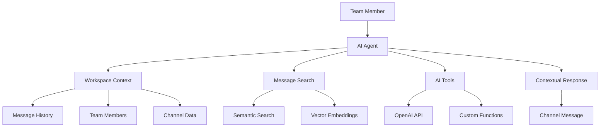

AI Agents are one of Pager's most powerful and unique features. These intelligent assistants integrate seamlessly into your team conversations, providing contextual help, searching through your message history, and offering insights based on your workspace's collective knowledge.

## What Are AI Agents?

AI Agents in Pager are context-aware assistants powered by OpenAI's latest models. Unlike traditional chatbots, these agents understand your team's communication patterns, can search through your entire message history, and provide personalized responses based on your workspace's unique context.

<Frame>

</Frame>

## Key Capabilities

<CardGroup cols={2}>
  <Card title="Contextual Understanding" icon="brain">
    **Smart Context Awareness**: Understands conversation history, team relationships, and project context
    **Channel-Specific Knowledge**: Adapts responses based on the channel and ongoing discussions
  </Card>
  
  <Card title="Semantic Search" icon="magnifying-glass">
    **Message History Search**: Find relevant conversations and information from your team's past discussions
    **Natural Language Queries**: Search using natural language rather than specific keywords
  </Card>
  
  <Card title="Real-time Assistance" icon="bolt">
    **Streaming Responses**: Get answers in real-time with streaming text generation
    **Instant Availability**: Always ready to help without delays or downtime
  </Card>
  
  <Card title="Tool Integration" icon="wrench">
    **Search Functions**: Access to workspace search and message retrieval
    **Time Awareness**: Understands temporal context for historical queries
    **Member Information**: Can provide information about team members and their roles
  </Card>
</CardGroup>

## Creating Your First AI Agent

<Steps>
  <Step title="Navigate to AI Agents">
    In your Pager workspace, click on **"AI Agents"** in the main navigation or go to Settings → AI Agents
  </Step>
  
  <Step title="Create New Agent">
    Click **"Create Agent"** to start configuring your AI assistant
  </Step>
  
  <Step title="Basic Configuration">
    Configure the fundamental settings:
    
    <Tabs>
      <Tab title="Agent Identity">
        - **Name**: Choose a memorable name (e.g., "Team Assistant", "Code Helper", "Project Oracle")
        - **Description**: Brief explanation of the agent's purpose and capabilities
        - **Avatar**: Optional custom avatar for the agent (uses default AI icon if not set)
      </Tab>
      
      <Tab title="Personality & Instructions">
        - **System Instructions**: Define how the agent should behave and respond
        - **Tone**: Set the communication style (professional, casual, technical, friendly)
        - **Expertise Areas**: Specify domains where the agent should be particularly helpful
      </Tab>
    </Tabs>
  </Step>
  
  <Step title="Advanced Settings">
    Fine-tune the agent's behavior:
    
    - **Response Length**: Prefer concise or detailed responses
    - **Proactiveness**: How often the agent should offer unsolicited help
    - **Channel Permissions**: Which channels the agent can participate in
    - **Tool Access**: Which tools the agent can use (search, time queries, etc.)
  </Step>
  
  <Step title="Test Your Agent">
    Start a conversation to test the agent's responses:
    ```
    @Team Assistant help me find our discussion about the new feature from last week
    ```
  </Step>
</Steps>

## Example Agent Configurations

### Development Team Assistant

<CodeGroup>
```yaml Configuration
Name: "DevBot"
Description: "Helps with code reviews, deployment info, and technical discussions"

System Instructions: |
  You are a helpful development team assistant. You have access to all team 
  conversations and can help with:
  
  - Finding past technical discussions and decisions
  - Providing context about code reviews and pull requests
  - Helping locate deployment information and release notes
  - Answering questions about team coding standards and practices
  
  Always be concise but thorough. Include relevant links when possible.
  Use a professional but friendly tone.

Tools: [search_messages, get_conversation_context, parse_time_expression]
```
</CodeGroup>

### Project Manager Agent

<CodeGroup>
```yaml Configuration  
Name: "Project Oracle"
Description: "Tracks project status, deadlines, and team coordination"

System Instructions: |
  You are a project management assistant focused on helping the team stay 
  organized and informed. You excel at:
  
  - Tracking project milestones and deadlines
  - Finding status updates and progress reports
  - Identifying blockers and dependencies mentioned in conversations
  - Providing project timeline context
  - Helping coordinate team activities
  
  Be proactive in offering relevant project information. Use bullet points 
  for clarity when listing multiple items.

Tools: [search_messages, get_conversation_context, get_channel_info]
```
</CodeGroup>

### Knowledge Base Assistant

<CodeGroup>
```yaml Configuration
Name: "Knowledge Keeper"  
Description: "Maintains and shares team knowledge and best practices"

System Instructions: |
  You are the team's institutional memory. Your role is to:
  
  - Help new team members find important information
  - Locate documentation and best practices from past discussions
  - Identify relevant examples and case studies from team history
  - Answer questions about company policies and procedures
  - Connect related discussions and topics
  
  Always cite specific conversations or messages when referencing past 
  discussions. Be helpful in connecting dots between different topics.

Tools: [search_messages, get_conversation_context, get_workspace_members]
```
</CodeGroup>

## Using AI Agents Effectively

### Mention Patterns

<Tabs>
  <Tab title="Direct Questions">
    ```markdown
    @Team Assistant what did we decide about the database migration?
    @DevBot can you find the deployment checklist we created?
    @Project Oracle what are the current blockers for the mobile app?
    ```
  </Tab>
  
  <Tab title="Context-Heavy Queries">
    ```markdown
    @Team Assistant I'm looking for the conversation where Sarah mentioned 
    the API rate limiting issue. It was sometime last month.
    
    @Knowledge Keeper can you help our new developer understand our code 
    review process? Include any examples from recent discussions.
    ```
  </Tab>
  
  <Tab title="Proactive Assistance">
    ```markdown
    @Project Oracle we're planning the Q2 roadmap. Can you summarize what 
    we learned from Q1 retrospectives?
    
    @DevBot I'm working on the authentication system. What security 
    considerations did the team discuss previously?
    ```
  </Tab>
</Tabs>

### Best Practices for Agent Interaction

<AccordionGroup>
  <Accordion title="Provide Context">
    **Good**: "Find the discussion about API authentication where John mentioned security concerns"
    **Better**: "Find the API authentication discussion from last week where John raised security concerns about JWT tokens"
    
    The more context you provide, the more accurate and helpful the agent's response will be.
  </Accordion>
  
  <Accordion title="Be Specific About Timeframes">
    **Vague**: "What did we discuss about the mobile app?"
    **Specific**: "What mobile app decisions did we make in the last two weeks?"
    
    Time-specific queries help the agent focus on the most relevant information.
  </Accordion>
  
  <Accordion title="Ask Follow-up Questions">
    Don't hesitate to ask for clarification or additional information:
    ```markdown
    @Team Assistant can you find more details about that database issue?
    @DevBot what was the final resolution for the deployment problem?
    ```
  </Accordion>
  
  <Accordion title="Use Agents for Onboarding">
    AI agents are excellent for helping new team members:
    ```markdown
    @Knowledge Keeper can you help @new-developer understand our Git workflow?
    @Project Oracle what are the current project priorities for new contributors?
    ```
  </Accordion>
</AccordionGroup>

## Advanced Features

### Tool Integration

AI Agents have access to powerful tools that enhance their capabilities:

<Tabs>
  <Tab title="Message Search Tool">
    **Capability**: Search through all workspace messages using semantic similarity
    
    **Use Cases**:
    - Finding relevant past discussions
    - Locating specific decisions or announcements
    - Discovering related conversations across different channels
    
    **Example Query**: "Find conversations about database performance optimization"
  </Tab>
  
  <Tab title="Context Retrieval Tool">
    **Capability**: Get detailed context about specific conversations or channels
    
    **Use Cases**:
    - Understanding ongoing discussions
    - Getting up to speed on channel-specific topics
    - Analyzing conversation patterns and themes
    
    **Example Query**: "What's the current status of the #engineering-standup channel?"
  </Tab>
  
  <Tab title="Time Expression Parser">
    **Capability**: Understand and process natural time expressions
    
    **Use Cases**:
    - Filtering messages by time periods
    - Understanding temporal context in queries
    - Scheduling and deadline-related discussions
    
    **Example Query**: "What did we discuss about the product launch in the past month?"
  </Tab>
  
  <Tab title="Member Information Tool">
    **Capability**: Access workspace member information and relationships
    
    **Use Cases**:
    - Identifying subject matter experts
    - Understanding team roles and responsibilities
    - Connecting team members with relevant expertise
    
    **Example Query**: "Who on the team has experience with Kubernetes deployments?"
  </Tab>
</Tabs>

### Streaming Responses

AI Agents provide real-time streaming responses, showing their thinking process:

<Frame>
```markdown
👤 @Team Assistant help me understand our current API rate limiting approach

🤖 Team Assistant is thinking...

🤖 Let me search for recent discussions about API rate limiting...

🤖 I found several relevant conversations. Here's what I discovered:

**Current Rate Limiting Approach:**
- Using Redis-based rate limiting with sliding window algorithm
- Configured for 1000 requests/hour per API key
- Different tiers for free (100/hour) vs paid users (1000/hour)

**Recent Discussions:**
- Sarah mentioned in #backend-dev (3 days ago) that we might need to adjust limits for enterprise customers
- John shared performance metrics showing current limits are working well
- The team decided to implement rate limit headers for better client integration

**Next Steps Mentioned:**
- Add rate limit monitoring dashboard
- Consider implementing burst allowances for certain endpoints

Would you like me to find more details about any specific aspect?
```
</Frame>

## Managing AI Agents

### Agent Administration

<Steps>
  <Step title="Agent Dashboard">
    Access comprehensive agent management through Settings → AI Agents:
    - View all workspace agents
    - Monitor usage statistics and performance
    - Edit agent configurations
    - Enable/disable agents as needed
  </Step>
  
  <Step title="Usage Analytics">
    Track agent effectiveness with built-in analytics:
    - **Interaction Volume**: Messages and mentions per day/week
    - **Response Quality**: Team engagement with agent responses
    - **Popular Queries**: Most common types of requests
    - **Channel Activity**: Which channels use agents most frequently
  </Step>
  
  <Step title="Performance Optimization">
    Optimize agent performance based on usage patterns:
    - Refine system instructions based on common queries
    - Adjust tool permissions based on actual usage
    - Update agent personality to match team preferences
    - Add specialized knowledge for frequently asked topics
  </Step>
</Steps>

### Multiple Agent Strategy

For larger teams, consider creating specialized agents:

<Tabs>
  <Tab title="Role-Based Agents">
    - **Engineering Assistant**: Code, deployments, technical discussions
    - **Product Helper**: Features, user feedback, roadmap planning
    - **Design Guide**: UI/UX discussions, design decisions, brand guidelines
    - **Business Intelligence**: Metrics, KPIs, business discussions
  </Tab>
  
  <Tab title="Project-Based Agents">
    - **Mobile App Oracle**: Everything related to mobile development
    - **API Guardian**: Backend services and API-related discussions
    - **Infrastructure Bot**: DevOps, deployments, and system discussions
    - **Customer Success Helper**: Support, user feedback, and client communications
  </Tab>
  
  <Tab title="Function-Based Agents">
    - **Meeting Summarizer**: Extract action items and decisions from meeting discussions
    - **Knowledge Curator**: Maintain and organize team knowledge
    - **Onboarding Assistant**: Help new team members get up to speed
    - **Decision Tracker**: Track and follow up on team decisions
  </Tab>
</Tabs>

## Privacy and Security

### Data Handling

<AccordionGroup>
  <Accordion title="Message Access">
    - AI agents only access messages in channels where they're explicitly mentioned
    - Agents respect channel privacy settings and member permissions
    - Private conversations require explicit agent invitation
    - All agent interactions are logged for transparency
  </Accordion>
  
  <Accordion title="External API Usage">
    - OpenAI API is used for generating responses (data is not retained by OpenAI)
    - Message content is processed temporarily for generating responses
    - No persistent storage of conversations outside your Pager workspace
    - All API communications are encrypted in transit
  </Accordion>
  
  <Accordion title="Control and Transparency">
    - Workspace admins can view all agent configurations and activity
    - Individual users can control their interaction with specific agents
    - Complete audit trail of all agent actions and responses
    - Agents can be disabled or removed at any time
  </Accordion>
</AccordionGroup>

## Troubleshooting

### Common Issues

<AccordionGroup>
  <Accordion title="Agent not responding">
    **Possible Causes**:
    - Agent not properly mentioned (use @AgentName)
    - Agent disabled or not configured
    - Channel permissions not set correctly
    - OpenAI API connectivity issues
    
    **Solutions**:
    - Verify agent name spelling and mention format
    - Check agent status in workspace settings
    - Ensure agent has access to the current channel
    - Review error logs in agent dashboard
  </Accordion>
  
  <Accordion title="Irrelevant or poor responses">
    **Possible Causes**:
    - System instructions too vague or broad
    - Insufficient context in the query
    - Agent doesn't have access to relevant tools
    - Limited message history for context
    
    **Solutions**:
    - Refine system instructions to be more specific
    - Provide more context in your queries
    - Enable additional tools for the agent
    - Allow time for more conversation history to accumulate
  </Accordion>
  
  <Accordion title="Slow response times">
    **Possible Causes**:
    - High usage volume causing API delays
    - Complex queries requiring extensive search
    - Large workspace with extensive message history
    - Network connectivity issues
    
    **Solutions**:
    - Break complex queries into smaller parts
    - Use more specific timeframes in queries
    - Consider creating specialized agents for different topics
    - Check system status and connectivity
  </Accordion>
</AccordionGroup>

---

<CardGroup cols={2}>
  <Card title="Messaging Features" icon="message" href="/features/messaging">
    Learn about Pager's core messaging capabilities
  </Card>
  
  <Card title="Webhook Integrations" icon="webhook" href="/integrations/webhooks/overview">
    Connect external tools to enhance AI agent knowledge
  </Card>
</CardGroup>