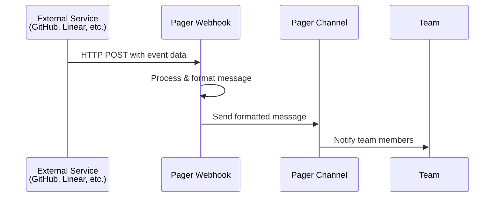

Webhooks are one of Pager's most powerful features, allowing you to seamlessly integrate external services and automate your team's workflow. By connecting services like GitHub, Linear, Jira, and Stripe, you can centralize all your important notifications and updates in one place.

## What Are Webhooks?

Webhooks are HTTP callbacks that external services send to Pager when specific events occur. When an event happens (like a new GitHub commit or a Stripe payment), the service automatically sends a structured message to your designated Pager channel.

<Frame>

</Frame>

## Supported Services

Pager supports webhooks from popular development and business tools:

<CardGroup cols={2}>
  <Card title="GitHub" icon="github" href="/integrations/webhooks/github">
    **Repository Events**: commits, pull requests, issues, releases
    **Notifications**: build status, security alerts, reviews
  </Card>
  
  <Card title="Linear" icon="linear" href="/integrations/webhooks/linear">
    **Issue Tracking**: issue updates, status changes, assignments
    **Project Management**: milestone progress, sprint updates
  </Card>
  
  <Card title="Jira" icon="jira" href="/integrations/webhooks/jira">
    **Issue Management**: ticket updates, status transitions
    **Project Tracking**: sprint planning, release management
  </Card>
  
  <Card title="Stripe" icon="credit-card" href="/integrations/webhooks/stripe">
    **Payment Events**: successful payments, failed charges
    **Subscription Management**: upgrades, downgrades, cancellations
  </Card>
  
  <Card title="Custom Webhooks" icon="webhook" href="/integrations/webhooks/custom">
    **Flexible Integration**: connect any service with HTTP webhooks
    **Custom Formatting**: tailor message content to your needs
  </Card>
</CardGroup>

## Key Features

### 🔒 **Secure Verification**
All webhooks support signing secrets to ensure messages come from legitimate sources. Pager verifies each webhook payload to prevent spoofing and maintain security.

### 📊 **Smart Formatting**
Each service has intelligent message formatting that presents information clearly:
- **Rich previews** with relevant details
- **Action buttons** for quick responses  
- **Status indicators** with color coding
- **Contextual information** like assignees and labels

### 📈 **Activity Tracking**
Monitor webhook usage with detailed analytics:
- Total requests received
- Success/failure rates
- Message delivery statistics
- Historical usage patterns

### ⚙️ **Easy Management**
Full webhook lifecycle management through Pager's intuitive interface:
- Create, edit, and delete webhooks
- Test webhook delivery
- View request logs and debugging information
- Manage signing secrets securely

## How Webhooks Work in Pager

### 1. **Webhook Creation**
When you create a webhook in Pager, you get:
- A unique webhook URL 
- Service-specific configuration options
- Optional signing secret setup
- Channel assignment for notifications

### 2. **External Service Configuration**
Configure the external service to send events to your Pager webhook URL:
- Add the webhook URL to your service settings
- Configure which events to send
- Set up signing secrets for security

### 3. **Message Processing**
When Pager receives a webhook:
- Verifies the signature (if configured)
- Processes the event data
- Formats a user-friendly message
- Delivers to the designated channel

### 4. **Team Notification**
Team members receive:
- Real-time notifications
- Formatted messages with context
- Action buttons for quick responses
- Threading for organized discussions

## Webhook Limits

Each workspace has reasonable limits to ensure optimal performance:

<Tabs>
  <Tab title="Service Limits">
    - **GitHub**: 5 webhooks per workspace
    - **Linear**: 5 webhooks per workspace  
    - **Jira**: 5 webhooks per workspace
    - **Stripe**: 5 webhooks per workspace
    - **Custom**: 5 webhooks per workspace
  </Tab>
  
  <Tab title="Rate Limits">
    - **Requests**: 1000 per hour per webhook
    - **Payload Size**: 1MB maximum per request
    - **Timeout**: 30 seconds response time
    - **Retries**: 3 automatic retry attempts
  </Tab>
</Tabs>

<Note>
  Need higher limits? Contact our support team to discuss enterprise options for larger teams with increased webhook requirements.
</Note>

## Quick Setup Guide

Get started with webhooks in just a few steps:

<Steps>
  <Step title="Navigate to Webhooks">
    In your Pager workspace, go to **Settings** → **Webhooks**
  </Step>
  
  <Step title="Create Webhook">
    Click **"Create Webhook"** and select your service type
  </Step>
  
  <Step title="Configure Settings">
    - Choose a descriptive name
    - Select the target channel
    - Configure signing secret (recommended)
  </Step>
  
  <Step title="Copy Webhook URL">
    Copy the generated webhook URL for use in your external service
  </Step>
  
  <Step title="Configure External Service">
    Add the webhook URL to your external service's settings
  </Step>
  
  <Step title="Test Integration">
    Trigger a test event to verify the integration works correctly
  </Step>
</Steps>

## Best Practices

### Security
- **Always use signing secrets** for production webhooks
- **Regularly rotate secrets** for enhanced security
- **Monitor webhook activity** for suspicious behavior
- **Use HTTPS URLs** for webhook endpoints

### Organization
- **Use descriptive names** for easy identification
- **Organize by team/project** using dedicated channels
- **Document webhook purposes** for team reference
- **Set up dedicated channels** for different notification types

### Monitoring
- **Check webhook status** regularly in the dashboard
- **Monitor delivery rates** to catch issues early
- **Review error logs** for troubleshooting
- **Set up alerts** for webhook failures

## Troubleshooting

Common issues and solutions:

<AccordionGroup>
  <Accordion title="Webhook not receiving events">
    - Verify the webhook URL is correctly configured in the external service
    - Check that the webhook is active and not paused
    - Ensure the external service is sending events to the correct endpoint
    - Review webhook logs for error messages
  </Accordion>
  
  <Accordion title="Signature verification failing">
    - Confirm the signing secret matches between Pager and the external service
    - Check that the external service is using the correct signature algorithm
    - Verify the webhook payload hasn't been modified in transit
    - Try regenerating the signing secret
  </Accordion>
  
  <Accordion title="Messages not appearing in channels">
    - Verify the webhook is assigned to the correct channel
    - Check channel permissions and membership
    - Ensure the channel still exists and is accessible
    - Review message filtering settings
  </Accordion>
</AccordionGroup>

## What's Next?

Ready to set up your first webhook integration? Choose your service:

<CardGroup cols={2}>
  <Card title="GitHub Setup" icon="github" href="/integrations/webhooks/github">
    Connect your repositories for development workflow notifications
  </Card>
  
  <Card title="Linear Setup" icon="linear" href="/integrations/webhooks/linear">
    Track project progress and issue updates automatically
  </Card>
  
  <Card title="Stripe Setup" icon="credit-card" href="/integrations/webhooks/stripe">
    Monitor payment events and subscription changes
  </Card>
  
  <Card title="General Setup Guide" icon="cog" href="/integrations/webhooks/setup">
    Step-by-step webhook configuration guide
  </Card>
</CardGroup>

---

<Tip>
  **Pro Tip**: Start with one integration at a time to familiarize yourself with the process, then add more services as needed. This approach helps you understand the workflow and troubleshoot any issues more effectively.
</Tip>